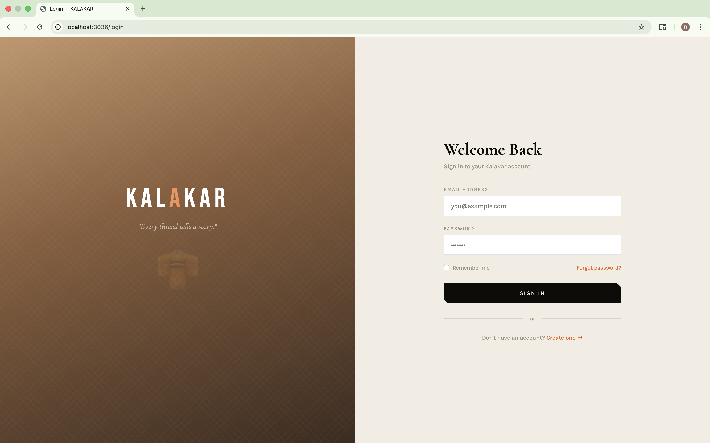
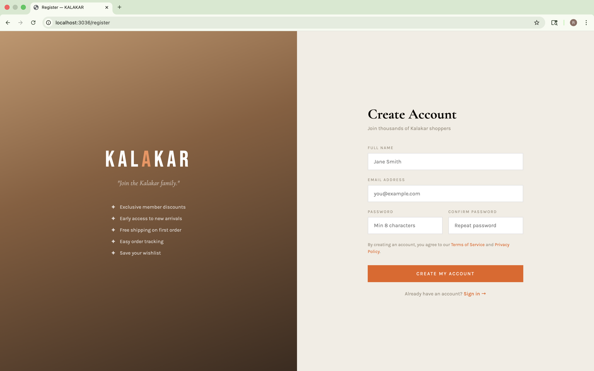
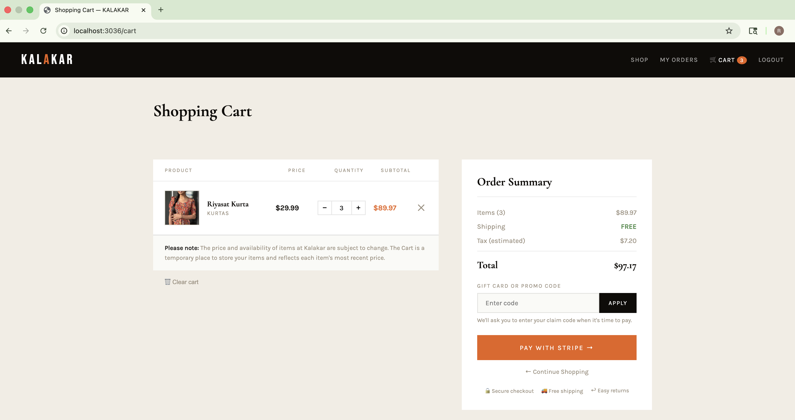
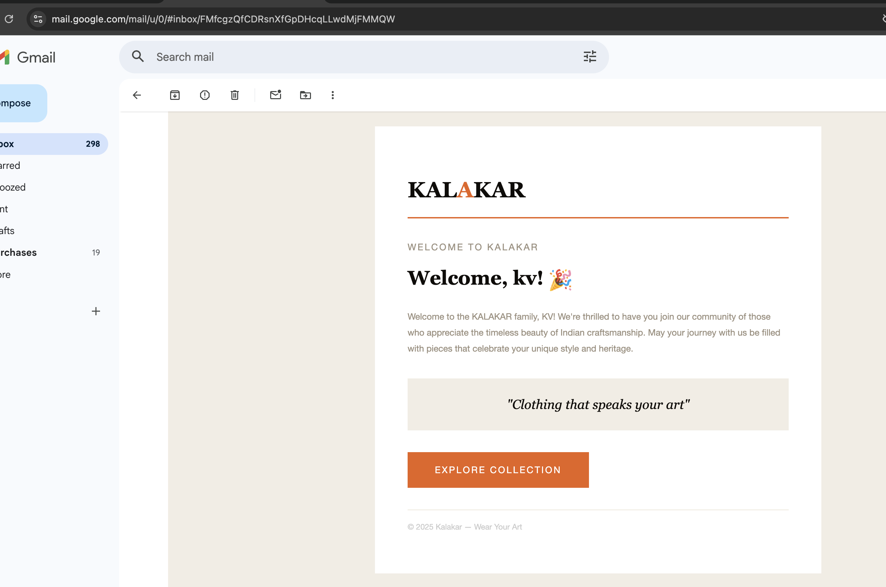
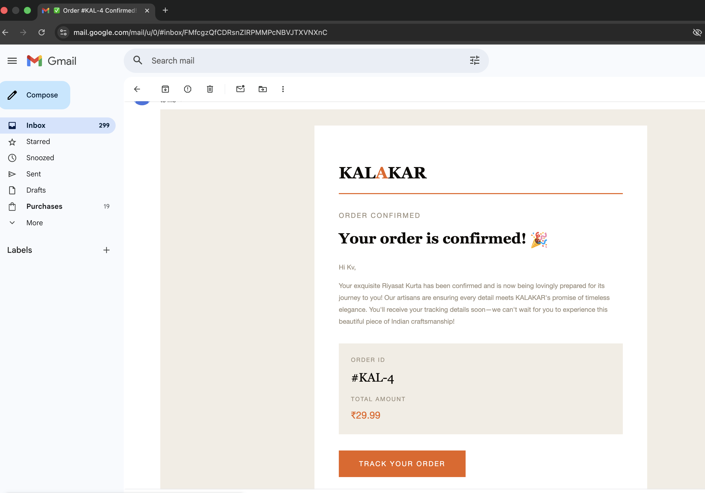
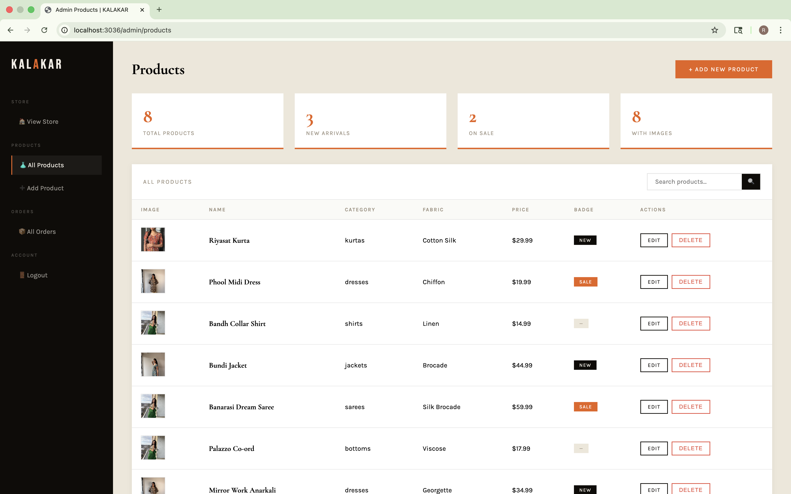
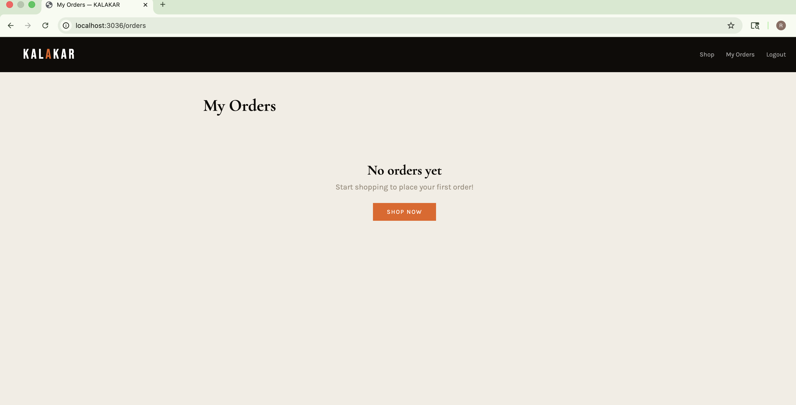
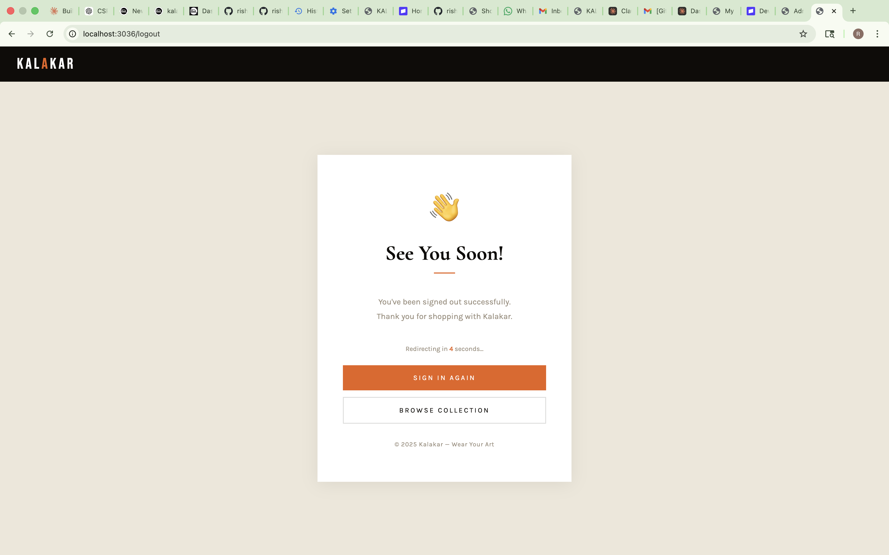

## Screenshots

















# KALAKAR — AI-Powered E-Commerce Platform


> A production-grade, full-stack e-commerce platform for Indian ethnic fashion — built with Java 21 and Spring Boot 3.5, featuring an **autonomous AI agent** powered by Anthropic's Claude API that monitors orders, generates personalized customer communications, and operates 24/7 without human intervention.

---

## 📸 Screenshots

> ## Screenshots


---

## 🤖 AI Integration — The Core Feature

This platform goes beyond standard e-commerce by embedding an **intelligent agent layer** directly into the order lifecycle.

### What the AI Agent Does

Every time an order status changes, the agent:

1. Receives the trigger from `OrderService`
2. Calls the **Anthropic Claude API** with structured context
3. Claude generates a **personalized, brand-consistent** email body
4. A branded HTML email is dispatched to the customer instantly

No two emails are the same. Every message is contextually aware of the customer's name, product ordered, current status, and Kalakar's brand voice.

### Autonomous Monitoring (Phase 3)

Three background jobs run independently on a schedule:
```java
// Detects orders stuck in PENDING for over 24 hours
@Scheduled(fixedRate = 3600000)
public void checkStuckPendingOrders()

// Identifies shipments not delivered after 5+ days
@Scheduled(cron = "0 0 9 * * *")
public void checkDelayedShipments()

// Sends post-delivery feedback requests
@Scheduled(cron = "0 0 18 * * *")
public void sendFeedbackRequests()
```

### Prompt Engineering

Claude is given structured, role-specific prompts to maintain brand voice:
```
You are a warm customer service assistant for KALAKAR,
a premium Indian ethnic wear brand.
Customer: {name} | Product: {product} | Status: {status}
Brand voice: warm, elegant, celebrates Indian fashion culture.
Respond in under 50 words. No greeting or sign-off.
```

---

## 🏗️ Architecture
```
┌──────────────────────────────────────────────────────────┐
│                     KALAKAR PLATFORM                      │
│                                                           │
│   Controller Layer → Service Layer → Repository (JPA)    │
│                                                           │
│   ┌─────────────────────────────────────────────────┐    │
│   │               AI Agent Layer                    │    │
│   │                                                  │    │
│   │  AIEmailService ──→ Anthropic Claude API        │    │
│   │  OrderMonitoringAgent (@Scheduled — 3 jobs)     │    │
│   │  OrderNotificationService (email orchestration) │    │
│   └─────────────────────────────────────────────────┘    │
│                                                           │
│   DTO Layer (7 DTOs) │ MapStruct │ Spring Security 6     │
└──────────────────────────────────────────────────────────┘
```

---

## 🛠️ Tech Stack

| Layer | Technology |
|---|---|
| **Language** | Java 21 |
| **Framework** | Spring Boot 3.5, Spring MVC |
| **AI / LLM** | Anthropic Claude API (claude-opus-4-5) |
| **Security** | Spring Security 6, BCrypt, CSRF, Session Management |
| **Database** | MySQL 8, Spring Data JPA, Hibernate |
| **Payments** | Stripe Checkout Sessions, Cash on Delivery |
| **Email** | Spring Mail, JavaMailSender, HTML Templates |
| **Mapping** | MapStruct (compile-time, zero reflection) |
| **Scheduling** | Spring @Scheduled (cron + fixed rate) |
| **Frontend** | Thymeleaf, HTML5, CSS3, Vanilla JS |
| **Build** | Maven 3.9 |

---

## ✨ Platform Features

### Customer
- Product catalog with category filtering
- Shopping cart with live item count badge
- Dual checkout — Stripe card payments + Cash on Delivery
- Real-time 6-stage order tracking (public, no login required)
- Visual delivery progress timeline
- Full order history with per-order tracking links
- AI-written welcome email on registration
- Secure password reset via time-limited email token (1hr expiry)

### Admin
- Role-based dashboard — completely separate from customer views
- Full product management — Add, Edit, Delete, Image upload
- Order status management — Pending → Confirmed → Packed → Shipped → Out for Delivery → Delivered
- Tracking number and courier assignment per order
- Order statistics panel — Total, Pending, Confirmed, Shipped, Delivered
- Admin login auto-redirects to orders dashboard

### Security
- Role-based access control — `ROLE_USER` / `ROLE_ADMIN`
- BCrypt password hashing at strength 12
- CSRF tokens on all state-changing forms
- Full session invalidation + JSESSIONID deletion on logout
- `ClearSiteDataHeaderWriter` — prevents authenticated page access via back button
- Zero credentials in version control — all secrets via gitignored `application.properties`

---

## 📁 Project Structure
```
src/main/java/com/kalakar/kalakar/
├── config/
│   ├── SecurityConfig.java              # Auth, roles, session, logout
│   └── SchedulingConfig.java            # @EnableScheduling
├── controller/
│   ├── AdminController.java             # Admin dashboard
│   ├── AuthController.java              # Login / Register / Password reset
│   ├── CartController.java              # Cart operations
│   ├── CheckoutController.java          # COD checkout
│   ├── HomeController.java              # Product catalog
│   ├── OrderController.java             # Customer orders
│   ├── PaymentController.java           # Stripe integration
│   └── TrackingController.java          # Order tracking
├── service/
│   ├── AIEmailService.java              # Anthropic Claude API client
│   ├── OrderMonitoringAgent.java        # Autonomous scheduled agent
│   ├── OrderNotificationService.java    # Email orchestration
│   ├── CartService.java
│   ├── EmailService.java
│   ├── OrderService.java
│   ├── StripeService.java
│   └── UserService.java
├── dto/                                 # 7 Data Transfer Objects
├── mapper/                              # MapStruct compile-time mappers
├── model/                               # JPA entities
└── repository/                          # Spring Data repositories
```

---

## ⚡ Getting Started

### Prerequisites
- Java 21+, Maven 3.9+, MySQL 8+
- Gmail account with App Password
- Anthropic API Key — [console.anthropic.com](https://console.anthropic.com)
- Stripe account (optional for payments)

### Run Locally
```bash
git clone https://github.com/yourusername/kalakar.git
cd kalakar

# Create database
mysql -u root -p -e "CREATE DATABASE kalakardb;"

# Configure credentials
cp src/main/resources/application.properties.example \
   src/main/resources/application.properties
# Edit with your DB, email, Anthropic, and Stripe credentials

# Start
mvn spring-boot:run
```

App runs at `http://localhost:3036`

### Test AI Agent Endpoints
```
GET /debug/test-ai        → Verify Claude API connection
GET /debug/test-email     → Send test email to inbox
GET /debug/trigger-agent  → Manually run all monitoring jobs
```

---

## 🔮 Roadmap

- [ ] Deploy to Railway with CI/CD pipeline
- [ ] WhatsApp order notifications via Twilio
- [ ] AI-powered product recommendations
- [ ] Customer profile and address book
- [ ] Admin analytics dashboard
- [ ] Inventory management system

---

## 👤 Author

**Risikanth Deva**
AI Integration Engineer · Full Stack Developer · Java Specialist

- 🔗 [LinkedIn](https://www.linkedin.com/in/rishi-d-a785a8263/)
- 📧 rishikanthjavadev@gmail.com
- 🐙 [GitHub](https://github.com/rishikanthjavadev-stack)

---

*Java 21 · Spring Boot 3.5 · Anthropic Claude · MySQL · Stripe · Spring Security 6*
